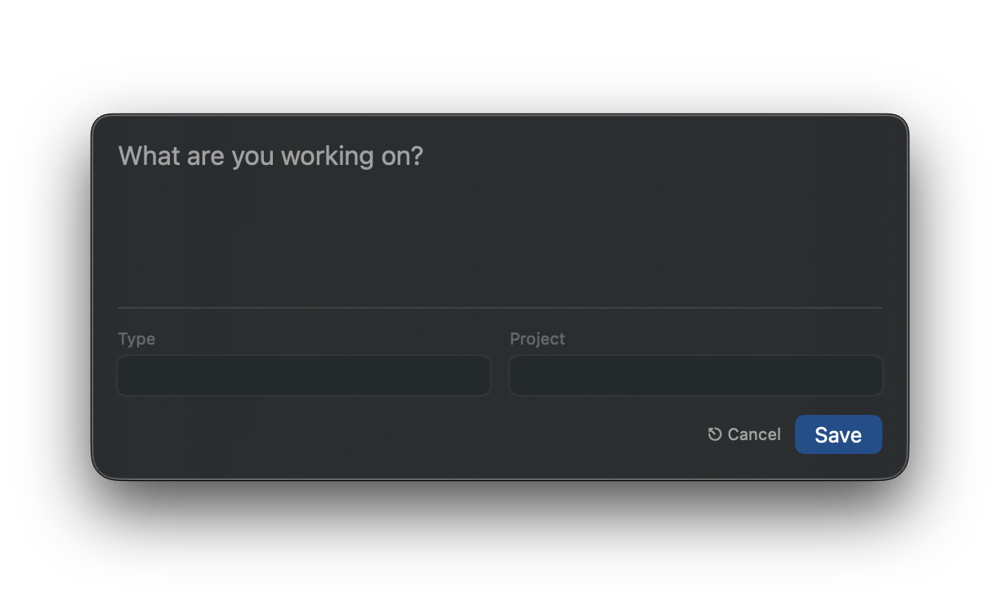
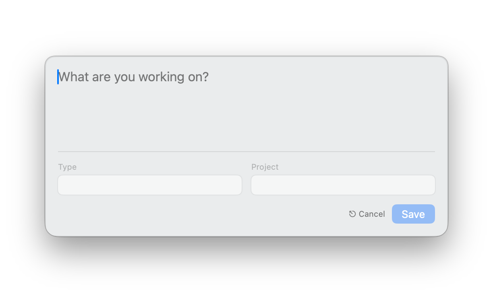

# Logger-TXT

A lightweight macOS menu bar application for quick timestamped logging. Press a
global hotkey, type your thought, and it's saved to a plain text file with a
timestamp.

This GUI _streamlined_ my use of
[Logger-TXT](https://github.com/grantlucas/Logger-TXT) allowing me to save
entries swiftly increasing my usage ten-fold throughout the day. I still use the
[CLI](https://github.com/grantlucas/Logger-TXT) for reviewing and searching
entries but _most, if not all,_ input has been through a GUI for the past
decade.

This is a modern Swift 6/SwiftUI rewrite of the Logger-TXT GUI, which originally started
as an Objective-C macOS app.

## Screenshots

<!-- markdownlint-disable MD013 MD060 -->
| Dark Mode | Light Mode |
|:---------:|:----------:|
|  |  |
<!-- markdownlint-enable MD013 MD060 -->

## Features

- **Global Hotkey**: Configure a hotkey to open the log entry window from
  anywhere
- **Spotlight-like UI**: Floating window that auto-dismisses when clicking
  outside
- **Timestamped Entries**: Each entry is automatically timestamped with date,
  time, and timezone
- **Optional Categorization**: Add a type (e.g., WORK, HOME) and project (e.g.,
  CLIENT-A) to entries
- **Autocomplete**: Type and project fields suggest values from your existing
  log
- **Plain Text Storage**: Logs are stored as simple text files compatible with
  grep, awk, and other Unix tools
- **Menu Bar App**: Lives in your menu bar, out of the way until needed
- **Launch at Login**: Optionally start Logger-TXT when you log in
- **Cloud-Friendly**: Point your log file to Dropbox, iCloud, or any synced
  folder for access across devices

## Philosophy

Logger-TXT is built on a simple principle: **your data should be portable and
durable**. By storing entries in plain text, you're never locked into a
proprietary format. Your log file works with grep, awk, any text editor, and
will remain readable decades from now.

No databases. No complex sync. No vendor lock-in. Just text.

## Use Cases

Logger-TXT is useful for tracking anything that benefits from a timestamp:

- **Work**: Log project progress, hours worked, and task completion
- **Personal**: Track habits, milestones, or daily activities
- **Purchases**: Record what you bought and when (useful for reconciling
  statements)
- **Events**: Note important conversations, decisions, or occurrences
- **Quick Capture**: Jot down thoughts before they slip away

The type and project fields let you categorize entries for easy filtering later
with standard Unix tools.

## Requirements

- macOS 14.0 (Sonoma) or later
- Xcode 16+ or Swift 6.0+ toolchain

## Installation

### From Source

```bash
# Clone the repository
git clone https://github.com/grantlucas/Logger-TXT-OSX-Rewrite.git
cd Logger-TXT-OSX-Rewrite

# Build and run
swift build && .build/debug/LoggerTXT

# Or create an app bundle
./Scripts/bundle.sh

# Install to Applications
cp -r .build/release/Logger-TXT.app /Applications/
```

## Usage

1. Launch Logger-TXT - it appears in your menu bar
2. Set a global hotkey in Preferences (click the menu bar icon → Preferences →
   Hotkey)
3. Press your configured hotkey to open the entry window
4. Type your message
5. Optionally press Tab to add a type and/or project
6. Press ⌘Enter to save, or Escape to cancel

### Keyboard Shortcuts

<!-- markdownlint-disable MD013 -->
| Shortcut       | Action                            |
|:---------------|:----------------------------------|
| (configurable) | Open entry window (global hotkey) |
| Tab            | Move to next field                |
| ⇧Tab           | Move to previous field            |
| ⌘Enter         | Save entry and close              |
| Escape         | Cancel and close                  |
| ↑↓             | Navigate autocomplete suggestions |
<!-- markdownlint-enable MD013 -->

### Log Format

Entries are stored in plain text with the following format:

```text
{DD/MM/YY HH:MM} {±HHMM} - [{TYPE} [({PROJECT})] - ]{message}
```

Examples:

```text
10/02/26 08:15 -0800 - Just a quick note
10/02/26 08:32 -0800 - WORK - Starting on the new feature
10/02/26 09:00 -0800 - WORK (CLIENT-A) - Finished the API integration
```

### Default Log Location

```text
~/Documents/Logger-TXT/log.txt
```

This can be changed in Preferences (click the menu bar icon → Preferences).

## Contributing

See [CONTRIBUTING.md](CONTRIBUTING.md) for development setup, architecture,
and coding guidelines.

## Acknowledgments

- [Original Logger-TXT shell script][2] and concept
- [Sindre Sorhus][1] for the excellent macOS Swift libraries

## Related

- [Logger-TXT (shell script)][2] - The original command-line version
- [Logger-TXT project page][3] - More about the project's history and philosophy

[1]: https://github.com/sindresorhus
[2]: https://github.com/grantlucas/Logger-TXT
[3]: https://grantlucas.com/page/logger-txt/
